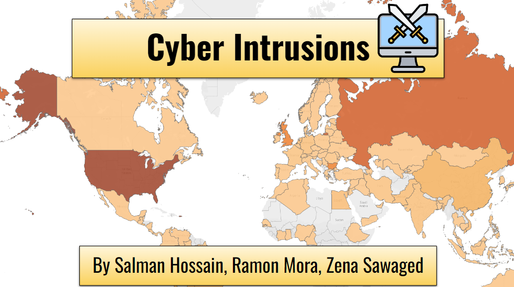
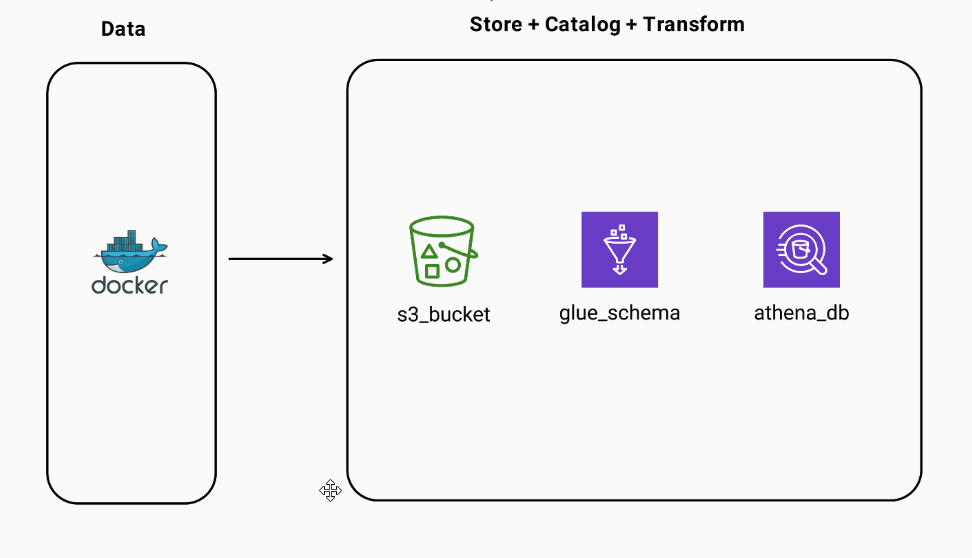
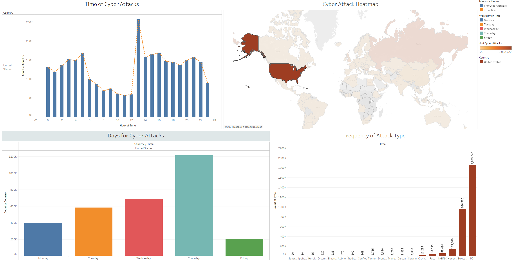

The problem we are attempting to solve is pinpointing/summarizing identifying information regarding attempted hacks such as location, time, network, etc. We need data to help solve this problem because the more information we have on our attackers the better prepared we can be to prevent attempted intrusions going forward.

The questions guiding our analysis are:

- Where do most hack attempts come from?
- When do most hack attempts occur?
- What are signifying features of an attempted intrusion?


We began our analysis by reviewing an example dataset. This allowed us to practice our approach to Exploratory Data Analysis (EDA) and familiarize ourselves with key cybersecurity terms while our TKH honeypot collected the data necessary for our actual analysis.

After we recieved our raw data which landed in our S3 bucket there was a number of ETL operations that had to be done before it was clean enough for analysis and visualizations.

The raw data from our honey pot did not have the columns we were expecting and also had mislabeled columns. Along with missing data and misformated data types that had to be resolved before preceeding to visualizations and modeling.


The `notebooks` folder contains the eda and other jupyter notebooks for the project.

The `code` folder contains functions written in order to interact with the S3 bucket to do things like extract, merge, pull and push data.

The `images` folder contains images used in the readme and also visualizations like plots and graphs generated from jupyter notebooks.

1. Pull repo into your work environment.
2. Setup a virtual environment this can be done using virtualenv.

```
pip install virtualenv
```

3. Activate the virtualenv (this will be different based on operating system not shown below) and install the dependencies for the project from requirements.txt in that environment to avoid conflicts.

``` bash
pip install -r requirements.txt
```


3. Create config.py which should contain aws credentials to access the S3 bucket. An example of what config.py should look like displayed below.

```
aws_access_key_id = "your-access-key-id"
aws_secret_access_key = "your-aws-secret-key"
```

Once set up the following codeblock will be able to execute provided that libraries are properly installed and view the merged_output.csv from the S3 bucket.


``` python

# some initial variables
bucket_name = "tkh-nyc-intrusions"
object_key = "merged_output.csv"

# open client
client = boto3.client('s3',
                      aws_access_key_id=config.aws_access_key_id,
                      aws_secret_access_key=config.aws_secret_access_key)

# retrieve objects in S3 bucket
response = client.get_object(
    Bucket=bucket_name,
    Key=object_key,
)

# read in data from request
data = response['Body'].read()

# transform into pandas dataframe by reading in bytes
df = pd.read_csv(io.BytesIO(data))

# print head
print(df)
```




The honeypot is setup using docker using a docker image from [tpotce](https://github.com/telekom-security/tpotce?tab=readme-ov-file). The raw data collected from the honey pot than lands in a S3 bucket. Afterwards extract load and transformations happen using AWS glue studio. Later stored in a data store in AWS athena.

After the data has been cleaned the data is visualized in tableau which can be found [here](https://public.tableau.com/app/profile/salman8177/viz/CyberIntrusions/Dashboard1?publish=yes).




Once the data was cleaned by resolving issues with the raw data collected from the honey pot. The visualizations revealed that United States, Russia and China are the countries commiting majority of the cyber attacks.

Another key insight from the data is that thursday seems to be the weekday that most countries launch cyber attacks. 

In regards to patterns of attack its all over the place and there is no overall consistent time in the day that countries attack. However generally attacks seem to happen later in the afternoon in EST. 

Interesting enough majority of the attacks were aimed towards cyber security tools like Pof which is a tool to fingerprint passive traffic. The second being Suricata which is a network security monitoring engine. 


Some of the challenges faced during the process of this project included data cleaning. Due to not having access to our raw data we used a placeholder dataset for our initial exploratory data analysis. However the columns we were expecting did not match the ones that we recieved and thus had to modify our eda.

Another area that blocked progress was permissions in AWS. Figuring out how to setup credentials without exposing them and also have different AWS services talk to each other was a learning step for this project. Along with using glue studio for our ETL and understanding the advantages of the tools provided by glue studio.

Future next steps can be a machine learning model that can be used to predict some target feature in the dataset using some secondary data source like a news soruce.

